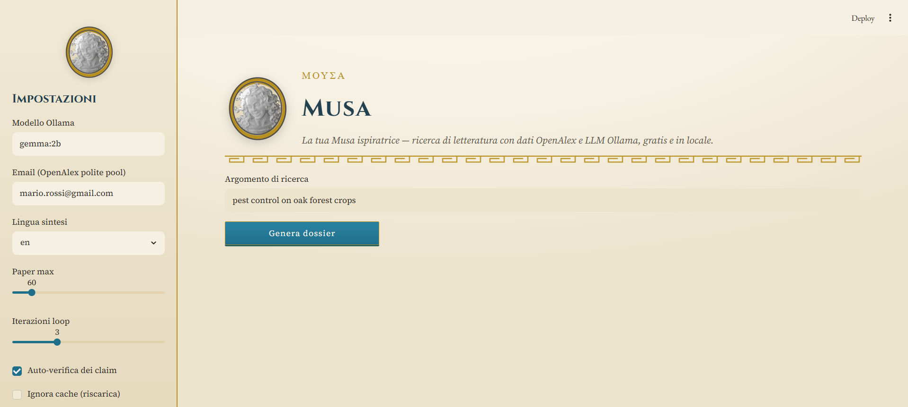
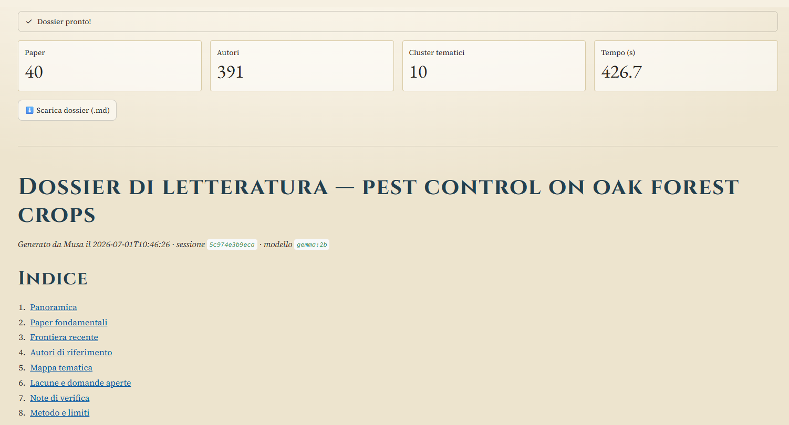
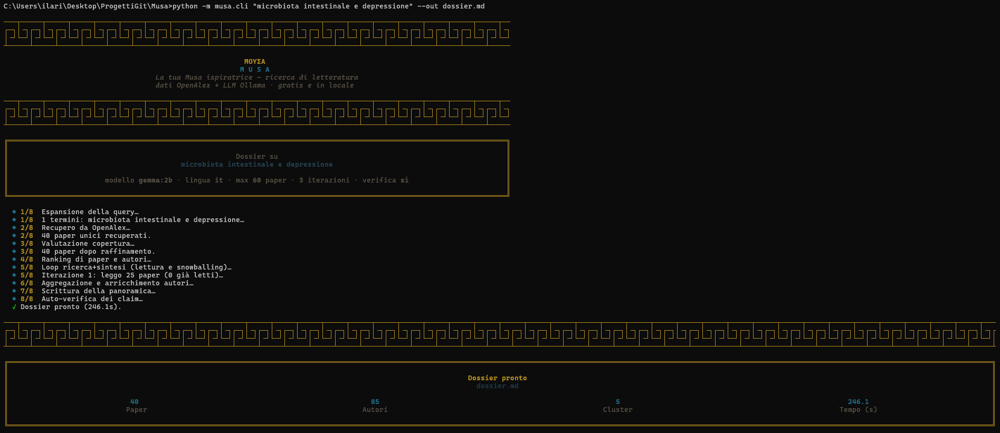

# Musa — Local literature research assistant

[🇮🇹 Italiano](README.md) · 🇬🇧 English

Musa generates a **literature dossier** on a topic: the most important papers
(ranked by relevance), the reference authors, and a **reasoned synthesis** of what is
known and what the open gaps are.

Everything is **free** and **local**: the data comes from open academic APIs (OpenAlex),
the reasoning and summaries from an **Ollama** model running on your machine.
No account, no cloud, no mandatory API key.

## Key idea

The LLM **is not the database**. It is never asked "which are the important papers on X"
(it would hallucinate titles and citations). The LLM is used only to **reason and
summarize** over real data retrieved from the APIs. It is an **agent on rails**: a
fixed-phase pipeline where code guarantees ordering and numeric accuracy, and the LLM
only decides where judgement is needed (how to expand the query, what to dig into, when
to stop).

## Architecture (phased pipeline)

```
0. Setup            [code]      session + cache
1. Query expansion  [LLM]       synonyms, related terms, EN/IT
2. Retrieval        [code]      OpenAlex -> SQLite cache, dedup
3. Coverage         [LLM]       enough results? broaden/narrow (max 2 cycles)
4. Ranking          [code]      FWCI, normalized citations, recency
5+7. Research+Synth [LLM+code]  iterative loop: read -> thematic map ->
                                find gaps -> follow targeted citations -> repeat
8. Self-verification [LLM+code] is every claim anchored to a real paper?
9. Composition      [code]      final Markdown dossier
```

The phases where the LLM has autonomy **always** have a deterministic guardrail beside
them (counter, threshold, hard cap), so the agent cannot loop or consume unlimited
resources.

## Requirements

- Python 3.10+
- [Ollama](https://ollama.com) installed and running, with at least one model
  (e.g. `ollama pull gemma:2b`)
- Internet connection (only to query OpenAlex)

> **Note on OpenAlex and the API key.** For some time now OpenAlex, when under load,
> blocks anonymous searches by returning a 503 error ("Anonymous search is temporarily
> rate-limited"). The solution is a **free API key** (quick sign-up at
> <https://openalex.org/rest-api>): set it in `config.yaml` (`openalex.api_key`) or in
> the `OPENALEX_API_KEY` environment variable. Metadata fetching and snowballing
> (non-search endpoints) work without a key anyway; only the initial keyword search may
> be gated. If the key is missing and search is blocked, Musa tells you with a clear
> message instead of failing obscurely.

### Small models, synthesis quality

With very small models (`gemma:2b`, `gemma3:1b`) the infrastructure works but the
synthesis is shallow and sometimes uses paper titles as cluster names. For
researcher-grade results use a more capable model (e.g. the Qwen/Llama family at
7-14B) if your hardware allows it: just change `llm.model` in `config.yaml`.

## Installation

```bash
pip install -r requirements.txt
```

Copy and customize the configuration:

```bash
cp config.example.yaml config.yaml
# set your email (for OpenAlex's "polite pool") and the Ollama model (llm.model)
```

### Custom Ollama model (`Modelfile`) — optional but recommended

The `Modelfile` defines an Ollama model tailored for Musa. Compared to the base model it
adds:

- an **anti-hallucination system prompt** (don't invent papers/DOIs/numbers, distinguish
  strong from weak evidence, clean JSON when requested);
- `temperature 0.2` to favor rigor over creativity;
- `num_ctx 8192` to fit more abstracts together in the context.

Create it like this:

```bash
ollama create musa -f Modelfile
```

Then **tell Musa to use it**, otherwise it stays unused — set in `config.yaml`:

```yaml
llm:
  model: musa
```

or pass it on the fly from the CLI with `--model musa`.

> **Caveat on the base model.** The `Modelfile` starts from `FROM gemma:2b`: if you leave
> it as is, `musa` inherits the limits of small models described above (shallow
> synthesis). For better quality, open the `Modelfile`, change the `FROM` line to a more
> capable model you already downloaded (e.g. `FROM qwen2.5:7b`) and re-run
> `ollama create musa -f Modelfile`.

## Usage

### CLI

```bash
python run.py "reinforcement learning from human feedback"
# or
python -m musa.cli "gut microbiota and depression" --out dossier.md --lang en
```

Useful options:

```
--model gemma:2b        Ollama model to use
--lang it|en            language of the final dossier (title, sections, synthesis)
--max-papers 120        cap on processed papers
--iterations 4          max iterations of the research+synthesis loop
--no-verify             skip the self-verification phase (faster)
--fresh                 ignore the cache and re-download everything
```

> The `--lang` option (or `output.language` in `config.yaml`) only affects the language
> of the **report**: title, section headings and the synthesis prose. It does **not**
> change the searched literature — the search terms always include the English variants,
> since scientific literature is mostly in English.

### Web interface (Streamlit)

```bash
streamlit run app.py
```

## Screenshots







## Project structure

```
musa/
  config.py        configuration loading + defaults
  models.py        dataclasses: Paper, Author, ThematicMap, Dossier
  cache.py         SQLite cache (API-polite, fast re-runs)
  llm.py           Ollama client with robust JSON parsing
  ranking.py       deterministic ranking of papers and authors
  prompts.py       all the LLM prompts (in a single place)
  sources/
    openalex.py    OpenAlex client
  pipeline/
    orchestrator.py  the agent on rails (lines up the phases)
    phases.py        the individual phases
  cli.py           terminal entry point
app.py             Streamlit web interface
Modelfile          definition of the custom Ollama model
```

## Known limits

- Synthesis quality depends on the Ollama model: a 1-2B model is fast but shallow; with
  adequate hardware use larger models for better results.
- Importance metrics (citations, h-index, FWCI) have known biases: the dossier uses them
  as **hints**, not as absolute truth, and says so.
- Full text is not integrated yet: the synthesis works on abstracts (Variant A).
  The code is set up to add full-text RAG on the top papers in the future.
